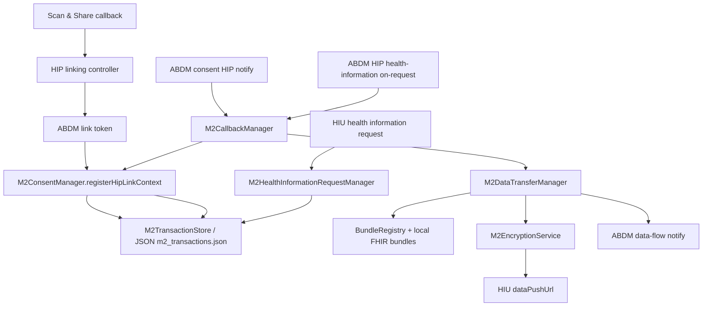

# ABDM M2 Architecture Audit

## Data Flow Graph



## M2 Surface Area Audited

- Routes: `backend/m2/routes/m2AuthRoutes.js`, `m2ConsentRoutes.js`, `m2CallbackRoutes.js`, `m2DataTransferRoutes.js`, plus legacy HIP callback mounts in `backend/app.js`.
- Controllers: `m2AuthController.js`, `m2ConsentController.js`, `m2CallbackController.js`, `m2DataTransferController.js`, and legacy `controllers/hipLinkingController.js`.
- Managers/services: `M2ConsentManager`, `M2CallbackManager`, `M2HealthInformationRequestManager`, `M2HealthInformationManager`, `M2DataTransferManager`, `M2TokenManager`, `M2SessionManager`, `M2AuthenticationManager`, `M2EncryptionService`.
- Persistence and caches: `M2TransactionStore`, `JSONTransactionStorage`, `backend/data/m2_transactions.json`, token files under `.m2_tokens`, `BundleRegistry`, callback/link token in-memory maps in `utils/*Store.js`, and singleton instances in M2 managers.

## Root Cause

Most failed consent records had `transactionId: ""` because the M2 transaction created after care-context linking did not extract the ABDM transaction from the signed link token. Later callback and sync paths updated transaction rows with normalized empty identifiers, so an empty value became durable. The HI request path then generated a local UUID when the ABDM transaction was missing, which violates the integration rule and leads to downstream lookup failures such as `Transaction with ID (canonical:) not found`.

## Identifier Propagation Fixes

- `transactionId`: now extracted from `linkToken` JWT payload during linked-context registration; preserved through consent notification callbacks; never fabricated by the HI request manager.
- `requestId`: preserved as the gateway or app request/callback correlation identifier, not substituted for `transactionId`.
- `consentId` / `consentArtefactId`: matched from `notification.consentId` and `notification.consentDetail.consentId`, stored in the same canonical transaction.
- `healthInformationRequestId` / `hiRequestId`: stored only when non-empty; empty callback values are ignored rather than clobbering existing identifiers.
- `careContextReference` / `patientReference`: consent notifications are matched back to linked context transactions by care context first, then patient/HIP.
- `linkToken`: stored as an identifier source and decoded only for metadata extraction; the token itself remains persisted.
- `hipId` / `hiuId` / bridge/session/correlation identifiers: protected at the store layer from empty overwrite.

## Persistence Fix

`M2TransactionStore.updateTransaction` now treats core identifiers as monotonic. Empty string, `null`, or `undefined` updates to protected identifier fields are ignored and audited in `identifierProtectionHistory`. Lookup canonicalization also normalizes IDs and supports additional aliases, preventing empty canonical lookups from silently proceeding.

## Gateway Payload Notes

- Consent on-notify and health-information responses use the original ABDM callback `requestId` inside `response.requestId`.
- HIP-originated callback acknowledgements include `X-HIP-ID` through the existing gateway header builder.
- Health information flow now requires a real ABDM `transactionId` before FHIR generation, encryption, data push, or gateway notify.

## Verification Harness

Run:

```bash
npm run verify:m2
```

The harness uses an isolated temp store and validates:

- link-token transactionId extraction;
- linked-context persistence;
- consent notification matching by care context;
- consent persistence with non-empty transactionId;
- empty identifier overwrite protection;
- JSON transaction persistence isolation.

## Remaining External Verification

The local architecture is now internally consistent for identifier propagation. Full ABDM compliance still requires a live sandbox pass because encryption transfer acceptance, subscription validation, and gateway behavior can only be conclusively verified against ABDM endpoints.
